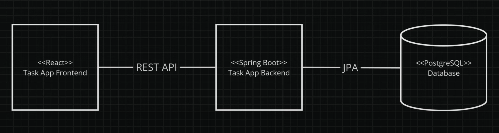
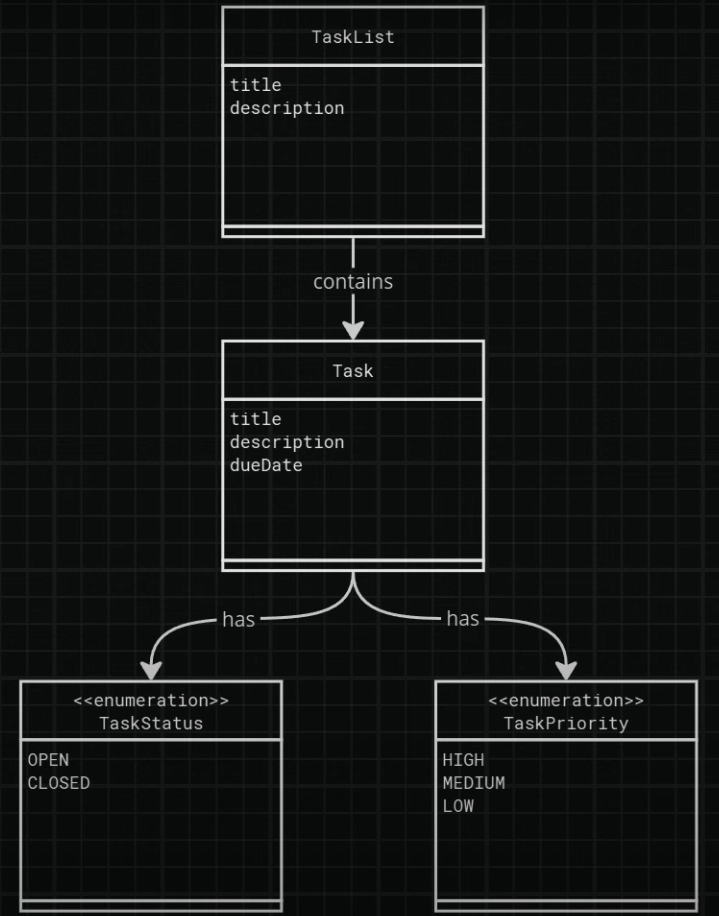
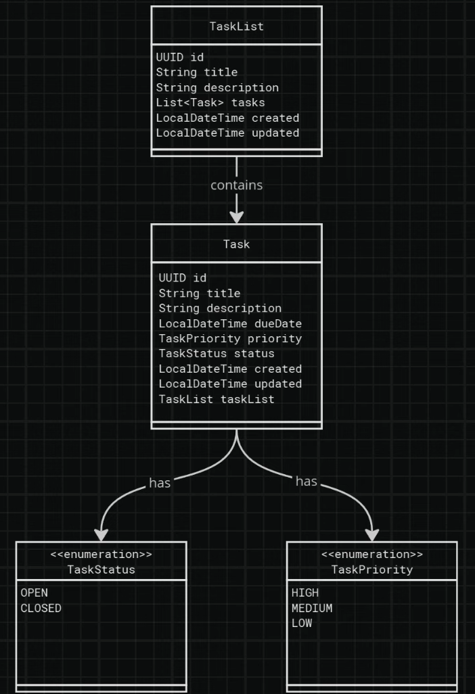
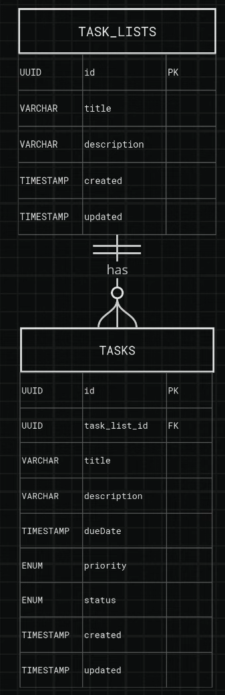

# Tasks Application

A Spring Boot application for tracking tasks.

## Project Overview

This is a task tracking application built with Spring Boot for the backend and React with TypeScript for the frontend, enabling users to create, manage, and track tasks efficiently.



## Features

- Task creation and management
- Task assignment
- Task status tracking
- Task categorization
- Dark/Light mode toggle for the frontend
- Responsive UI for task and task list management

## Technology Stack

### Backend
- **Spring Boot**: Framework for creating stand-alone, production-grade Spring-based applications
- **Spring Data JPA**: Simplifies data access layer implementation
- **H2 Database**: Lightweight in-memory database for development
- **PostgreSQL**: Production database
- **Maven**: Dependency management and build tool

### Frontend
- **React**: JavaScript library for building user interfaces
- **TypeScript**: Typed superset of JavaScript
- **Vite**: Fast build tool for modern web projects
- **Tailwind CSS**: Utility-first CSS framework
- **React Router**: Declarative routing for React applications

## Domain Model

The application is built around the following entities:





The core components include:



## REST API Endpoints

The backend provides RESTful APIs for managing task lists and tasks. For detailed documentation, refer to the [Tasks Backend README](tasks/README.md).

## Frontend Features

- **Task List Management**:
  - Display all task lists with their progress and task count.
  - Create, update, and delete task lists.
- **Task Management**:
  - Display tasks within a selected task list.
  - Create, update, and delete tasks.
  - Filter tasks by priority and status.
- **Dark/Light Mode**:
  - Toggle between dark and light themes.
- **Error Handling**:
  - Display error messages returned by the backend in a user-friendly way.

## Getting Started

### Prerequisites

- Java 21 or higher
- Maven 3.9+
- Node.js 18+ and npm 9+

### Running the Backend

1. Navigate to the `tasks` directory.
2. Start PostgreSQL using the provided `docker-compose.yml` file:
   ```bash
   docker-compose up -d
   ```
3. Run the Spring Boot application:
   ```bash
   ./mvnw spring-boot:run
   ```

### Running the Frontend

1. Navigate to the `tasks-fe` directory.
2. Install dependencies:
   ```bash
   bun install
   ```
3. Start the development server:
   ```bash
   bun run dev
   ```
4. Open the application in your browser at `http://localhost:5173`.

## Contributing

Contributions are welcome! Please feel free to submit a Pull Request.
