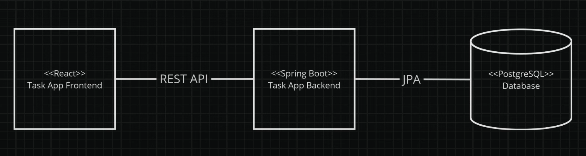
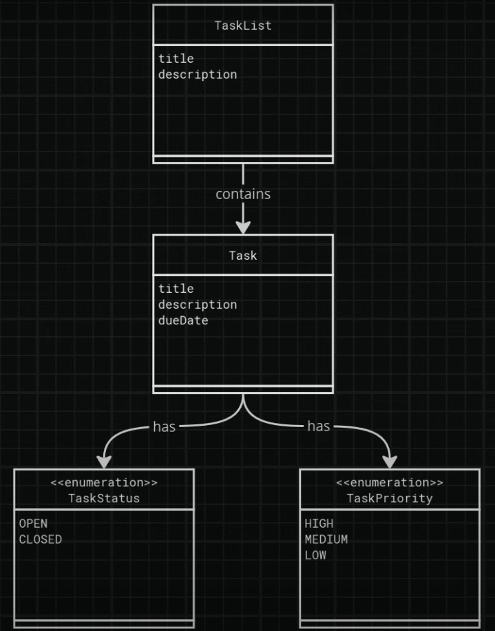
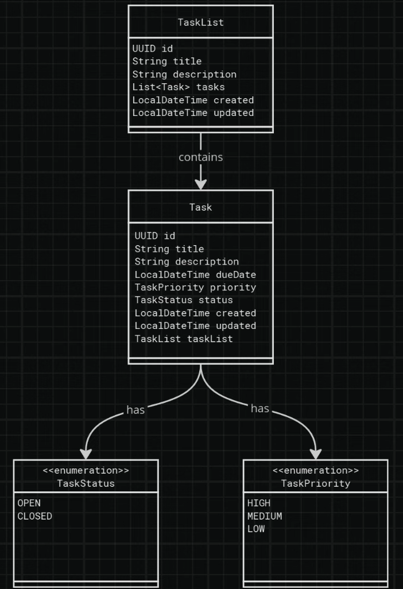
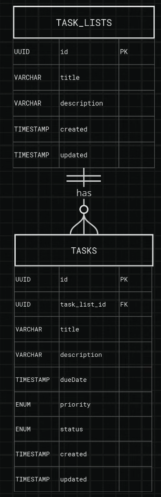

# Tasks Application

A Spring Boot application for tracking tasks.

## Project Overview

This is a task tracking application built with Spring Boot, enabling users to create, manage, and track tasks efficiently.

## Features

- Task creation and management
- Task assignment
- Task status tracking
- Task categorization

## Technology Stack

- **Spring Boot**: Framework for creating stand-alone, production-grade Spring-based applications
- **Spring Data JPA**: Simplifies data access layer implementation
- **H2 Database**: Lightweight in-memory database for development
- **PostgreSQL**: Production database
- **Maven**: Dependency management and build tool

## Domain Model

The application is built around the following entities:

The core components include:

## Getting Started

### Prerequisites

- Java 21 or higher
- Maven 3.9+

### Running the Application

1. Clone the repository
2. Navigate to the project directory
3. Run `./mvnw spring-boot:run`

## License

This project is licensed under the Apache License 2.0.

## Contributing

Contributions are welcome! Please feel free to submit a Pull Request.